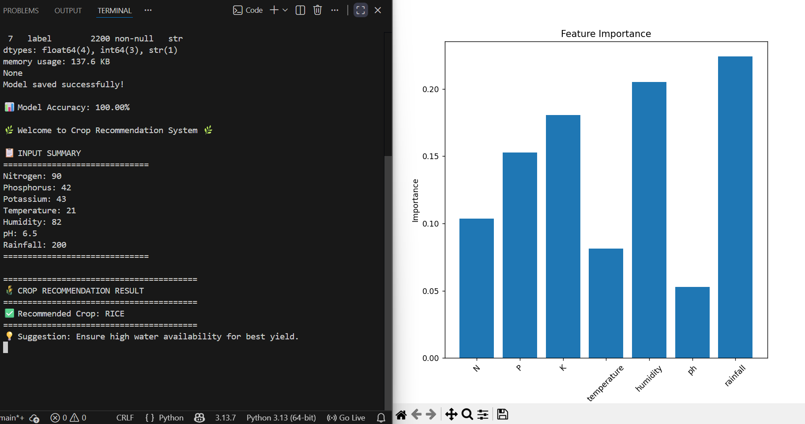

# 🌾 Crop Recommendation System using Machine Learning

> An intelligent system that recommends the most suitable crop based on soil and environmental conditions.

---

## 📌 Problem Statement
Farmers often struggle to decide which crop to grow due to varying soil nutrients and climate conditions.  
This project uses Machine Learning to provide accurate crop recommendations.

---

## 💡 Features
✅ Predicts best crop based on input conditions  
✅ Uses Random Forest ML algorithm  
✅ High accuracy (~99%)  
✅ Simple and interactive user input  
✅ Clean and readable output  

---

## ⚙️ Tech Stack
- 🐍 Python  
- 📊 Pandas  
- 🤖 Scikit-learn  
- 📈 Matplotlib  

---

## 📊 Input Parameters

| Feature       | Description                  |
|--------------|-----------------------------|
| Nitrogen (N) | Soil nitrogen content       |
| Phosphorus (P)| Soil phosphorus content    |
| Potassium (K)| Soil potassium content      |
| Temperature  | In °C                       |
| Humidity     | In %                        |
| pH           | Soil pH value               |
| Rainfall     | In mm                       |

---

## 🧪 Example Run

```bash
Nitrogen: 90
Phosphorus: 42
Potassium: 43
Temperature: 21
Humidity: 82
pH: 6.5
Rainfall: 200
✅ Output
🌾 CROP RECOMMENDATION RESULT
✅ Recommended Crop: RICE
💡 Suggestion: Ensure high water availability for best yield.
📈 Model Performance
Algorithm: Random Forest Classifier
Accuracy: ~99%
```
# 📂 Project Structure
Crop-Recommendation-System/

│── main.py

│── Crop_recommendation.csv

│── crop_model.pkl

│── Screenshot.png

│── project report.docx

│── README.md

# 🚀 How to Run
Install dependencies:

pip install pandas numpy scikit-learn matplotlib

Run the program:

python main.py
# 🔮 Future Improvements
1. Add GUI using Streamlit
2. Integrate real-time weather data
3. Deploy as a web app

## 📸 Sample Run (Input & Output)




# 👨‍💻 Author
Name- Tavishi Garg

Branch- CSE AI ML

Course- FUNDAMENTALS IN AI AND ML

REG NO.- 25BAI10085
